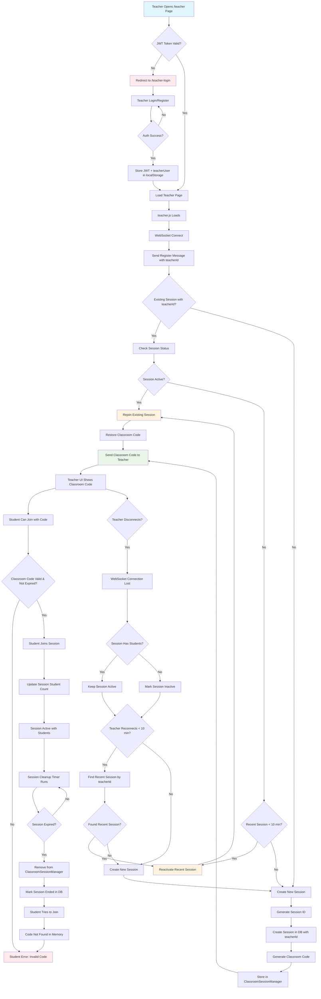
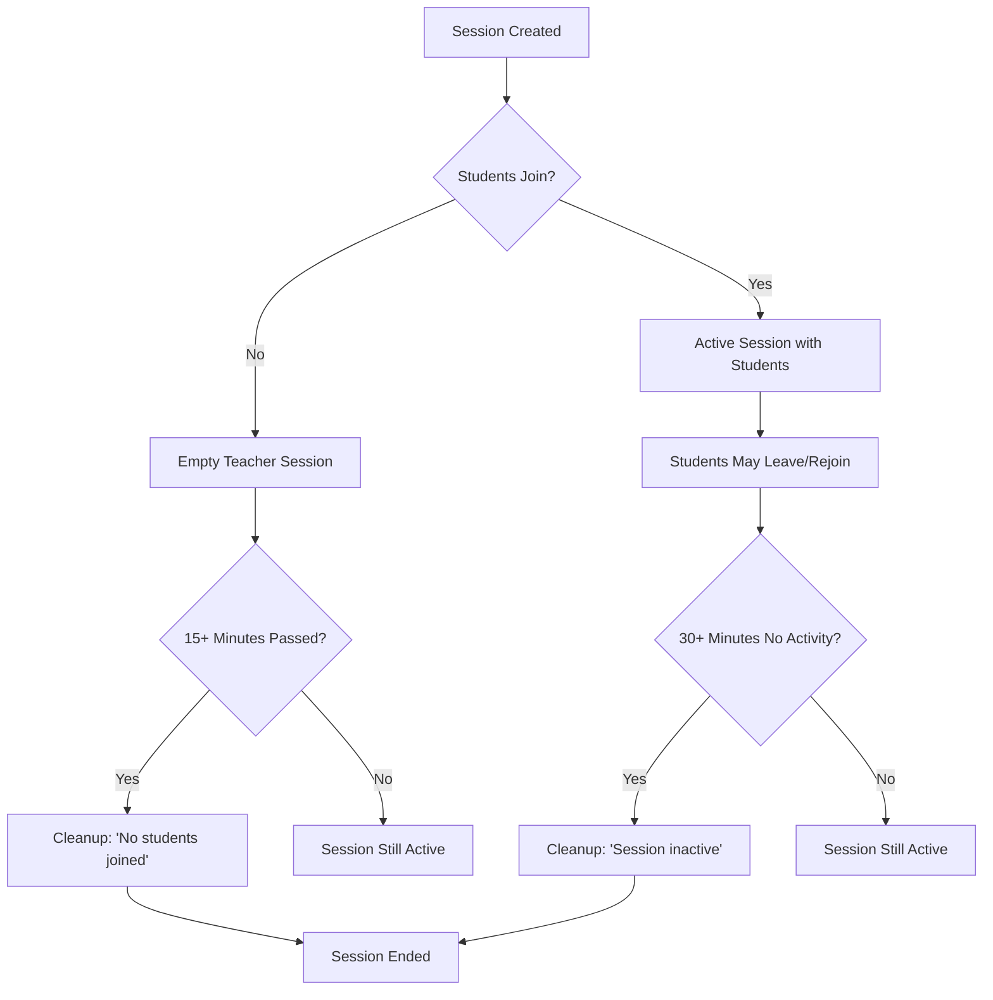

# Session Lifecycle Analysis & Flow Chart

## Current Session Logic Overview

After analyzing the codebase, here's the complete session lifecycle flow:

## Session Cleanup Logic (Simplified)

The session cleanup service has been simplified to handle two main scenarios:

### 1. Empty Teacher Sessions
- **Condition**: `studentsCount = 0` (no students ever joined)
- **Timeout**: 15 minutes (4.5 minutes scaled for tests)
- **Based on**: `startTime` (when teacher created the session)
- **Quality Reason**: "No students joined within X minutes"

### 2. General Inactivity Cleanup
- **Condition**: Any session with old `lastActivityAt`
- **Timeout**: 30 minutes (18 seconds scaled for tests) 
- **Based on**: `lastActivityAt` (when last meaningful activity occurred)
- **Quality Reason**: "Session inactive for X minutes"
- **Covers**: All scenarios including sessions where students left

## Session Cleanup Implementation

### `SessionCleanupService` Methods:

1. **`cleanupEmptyTeacherSessions()`**:
   - Finds sessions where `studentsCount = 0` and `startTime < 15 minutes ago`
   - Sets `isActive = false`, `quality = 'no_students'`

2. **`cleanupInactiveSessions()`**:
   - Finds sessions where `lastActivityAt < 30 minutes ago`
   - Sets `isActive = false`, `quality = 'no_activity'`
   - Covers all scenarios: students left, teacher inactive, etc.

3. **`markAllStudentsLeft(sessionId, reason?)`**:
   - Updates `qualityReason` for informational purposes
   - Does NOT update `lastActivityAt` (preserves last real activity time)

4. **`markStudentsRejoined(sessionId)`**:
   - Updates `lastActivityAt = now()` and clears `qualityReason`

5. **`updateSessionActivity(sessionId)`**:
   - Updates `lastActivityAt = now()` when translations occur

## Time Tracking Columns

- **`startTime`**: When the session was created
- **`lastActivityAt`**: When the last meaningful activity occurred (translations, connections)
- **`endTime`**: When the session was marked inactive

## Configuration Values

From `.env.test` (scaled by `TEST_TIMING_SCALE=0.01`):

- **Empty Teacher Timeout**: `SESSION_EMPTY_TEACHER_TIMEOUT_MS=270000` (4.5 minutes → 2.7 seconds scaled)  
- **Stale Session Timeout**: `SESSION_STALE_TIMEOUT_MS=1800000` (30 minutes → 18 seconds scaled)
- **Cleanup Interval**: `SESSION_CLEANUP_INTERVAL_MS=30000` (30 seconds → 0.3 seconds scaled)
- **Classroom Code Expiration**: `CLASSROOM_CODE_EXPIRATION_MS=1800000` (30 minutes → 18 seconds scaled)
- **Teacher Reconnection Grace**: `TEACHER_RECONNECTION_GRACE_PERIOD_MS=90000` (1.5 minutes → 0.9 seconds scaled)

## Key Benefits of Simplified Logic

✅ **No Complex Grace Periods**: Removed confusing "abandoned sessions" logic with multiple overlapping conditions

✅ **Guaranteed Cleanup**: Every session will be cleaned up within 30 minutes maximum (18 seconds in tests)

✅ **Simple Two-Scenario Model**: Easy to understand and debug

✅ **Proper Time Tracking**: `lastActivityAt` represents actual activity, not administrative markers

✅ **No Race Conditions**: Eliminated complex `qualityReason` parsing and overlapping timeouts

## Classroom Code Behavior

- **If teacher disconnects BEFORE students join**: Session becomes inactive after 15 minutes, classroom code expires after 30 minutes
- **If teacher disconnects AFTER students join**: Session stays active until 30 minutes of inactivity
- **If session expires**: Both database session and classroom code are cleaned up

## Missing Test Coverage 🧪

We now have comprehensive integration tests for:

### A. Teacher Authentication Flow
1. ✅ **Basic auth flow** (already covered)
2. ❌ **Token expiration during active session**
3. ❌ **Invalid token handling during WebSocket connection**

### B. Teacher Disconnection/Reconnection Scenarios  
1. ❌ **Teacher disconnects → reconnects < 10 min → same classroom code**
2. ❌ **Teacher disconnects → reconnects > 10 min → new classroom code**
3. ✅ **Teacher disconnects before students join → session becomes inactive** (covered by empty teacher timeout)
4. ✅ **Teacher disconnects after students join → session stays active** (covered by general inactivity)
5. ❌ **Multiple teacher connections with same teacherId (race condition)**
6. ❌ **Teacher closes browser tab vs network disconnect**

### C. Session Expiration Scenarios
1. ✅ **Session expires after teacher waiting** (empty teacher timeout)
2. ✅ **Session expires after general inactivity** (stale session timeout)
3. ❌ **Student tries to join expired session**
4. ✅ **Cleanup timer removes expired sessions**

### D. Classroom Code Lifecycle
1. ❌ **Code generation is unique across sessions**
2. ❌ **Code persists across teacher reconnections (same session)**
3. ❌ **Code expires after configured time**
4. ❌ **Expired codes are properly cleaned up** 

### E. Student Join Edge Cases
1. ❌ **Student joins, teacher disconnects, student stays**
2. ❌ **Student joins expired session**
3. ❌ **Student joins with invalid code**
4. ❌ **Multiple students join simultaneously**

### F. Database Consistency
1. ✅ **Session state in DB matches cleanup logic**
2. ❌ **TeacherId persistence across all operations**
3. ❌ **Session analytics data accuracy**

## Recommended Test Implementation Priority

1. **High Priority**: Teacher reconnection scenarios (B1-B4)
2. **Medium Priority**: Classroom code lifecycle (D1-D4)
3. **Medium Priority**: Student join edge cases (E1-E4)
4. **Low Priority**: Race conditions and complex scenarios (B5, F)

The simplified session logic is much more maintainable and predictable!
