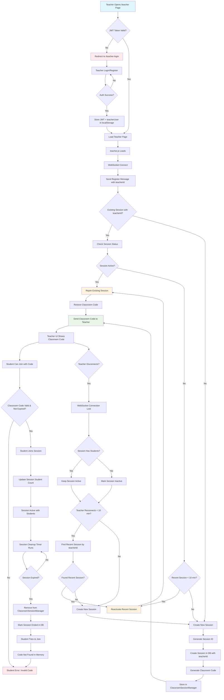
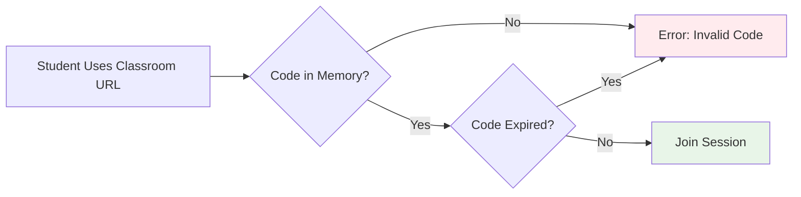

# Session Lifecycle Analysis & Flow Chart

## Current Session Logic Overview

After analyzing the codebase, here's the complete session lifecycle flow:

## Critical Issues Identified 🚨

### 1. **Session Persistence Logic is Complex**
- Multiple layers: WebSocket sessions, Database sessions, Classroom codes
- Different expiration timers for different components
- Race conditions possible during teacher reconnection

### 2. **Classroom Code Behavior Inconsistencies**
- **If teacher disconnects BEFORE students join**: Session becomes inactive, but classroom code persists in memory until cleanup
- **If teacher disconnects AFTER students join**: Session stays active, classroom code remains valid
- **If session expires**: Classroom code removed from memory, but DB session may still exist

### 3. **Teacher Reconnection Edge Cases**
- Teacher gets SAME classroom code if reconnecting to active session
- Teacher gets NEW classroom code if creating fresh session
- 10-minute window for reconnection to recent sessions
- Race condition if multiple teacher connections with same teacherId

### 4. **Student Join Behavior**

## Configuration Values
- **Classroom Code Expiration**: 2 hours (prod) / 30 seconds (test)
- **Cleanup Interval**: 15 minutes (prod) / 10 seconds (test)
- **Recent Session Window**: 10 minutes
- **Session Cleanup**: 2 minutes (prod) / 5 seconds (test)

## Missing Test Coverage 🧪

We need comprehensive integration tests for:

### A. Teacher Authentication Flow
1. ✅ **Basic auth flow** (already covered)
2. ❌ **Token expiration during active session**
3. ❌ **Invalid token handling during WebSocket connection**

### B. Teacher Disconnection/Reconnection Scenarios
1. ❌ **Teacher disconnects → reconnects < 10 min → same classroom code**
2. ❌ **Teacher disconnects → reconnects > 10 min → new classroom code**
3. ❌ **Teacher disconnects before students join → session becomes inactive**
4. ❌ **Teacher disconnects after students join → session stays active**
5. ❌ **Multiple teacher connections with same teacherId (race condition)**
6. ❌ **Teacher closes browser tab vs network disconnect**

### C. Session Expiration Scenarios
1. ❌ **Session expires while teacher connected**
2. ❌ **Session expires while students connected**
3. ❌ **Student tries to join expired session**
4. ❌ **Cleanup timer removes expired sessions**

### D. Classroom Code Lifecycle
1. ❌ **Code generation is unique across sessions**
2. ❌ **Code persists across teacher reconnections (same session)**
3. ❌ **Code expires after configured time**
4. ❌ **Expired codes are properly cleaned up**

### E. Student Join Edge Cases
1. ❌ **Student joins, teacher disconnects, student stays**
2. ❌ **Student joins expired session**
3. ❌ **Student joins with invalid code**
4. ❌ **Multiple students join simultaneously**

### F. Database Consistency
1. ❌ **Session state in DB matches in-memory state**
2. ❌ **TeacherId persistence across all operations**
3. ❌ **Session analytics data accuracy**

## Recommended Test Implementation Priority

1. **High Priority**: Teacher reconnection scenarios (B1-B4)
2. **Medium Priority**: Session expiration scenarios (C1-C4)
3. **Medium Priority**: Classroom code lifecycle (D1-D4)
4. **Low Priority**: Edge cases and race conditions (B5, E4, F)

This analysis reveals the session logic is quite complex with many potential edge cases that need comprehensive testing!
